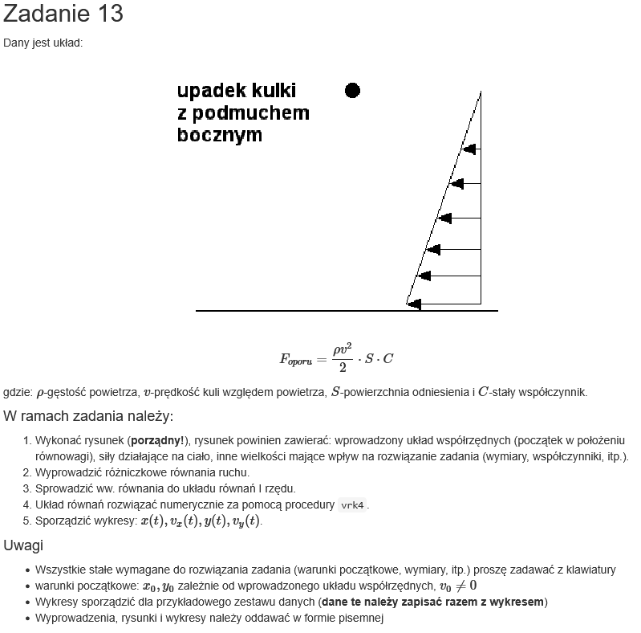

# WMN-Projekt
End of semester project for Intro to Numerical Methods class at MEiL PW. Involves solving a mechanical system described with differential equations using numerical solvers. 

[CCFD Courses WMN - zadnaia domowe](https://ccfd.github.io/courses/info2_projekty.html)

## Task:

*source: https://ccfd.github.io/courses/info2_projekty.html  - zadnie 13*

## Running/compiling
Everything is run on Windows 11 under WSL Ubuntu 24.04. 
To compile everything (C solver, Python plotter, LaTex Report) run:
``./run.sh``
You need some Python packages and C and LaTex compilers.